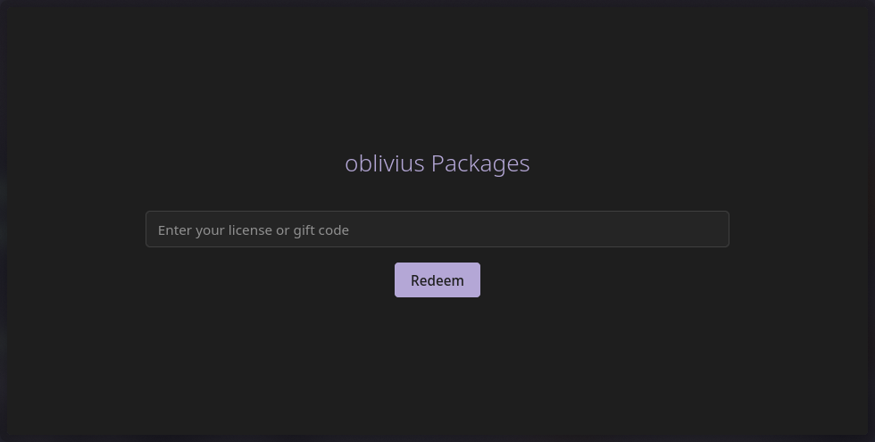
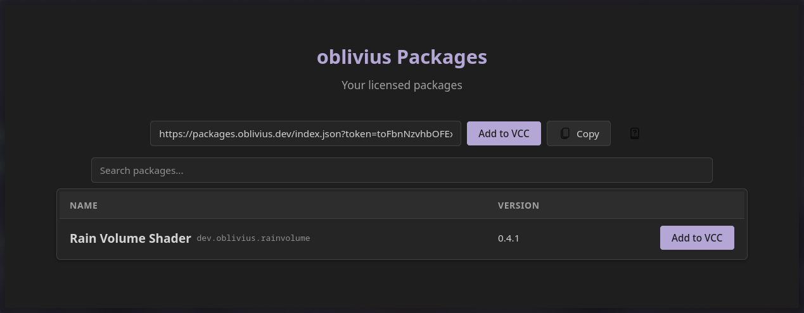
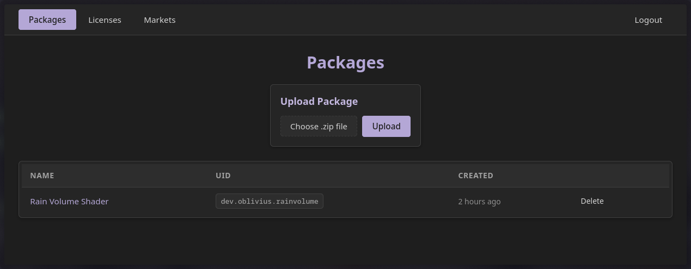
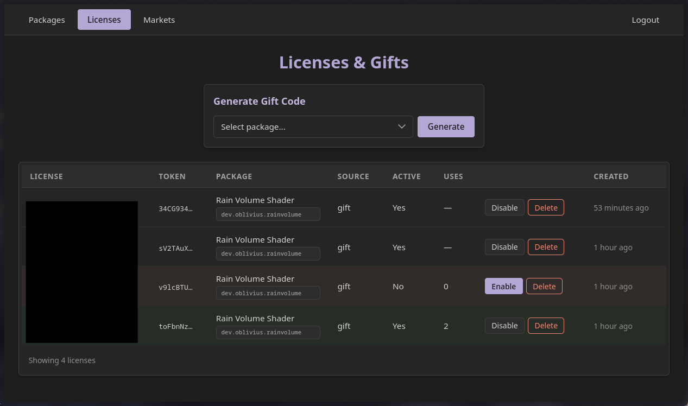

<div align="center">

# Private VPM Repository

A self-hosted, authenticated VPM repository server for VRChat creators who sell packages through online marketplaces.

<br>



</div>

<br>

## What

Self-hosted VPM repository with marketplace license verification, per-user authenticated listings, an admin panel for package and license management, and a gift code system.

## Why

VPM repositories have always been public. If you sell a Unity package on a marketplace, there's no built-in way to deliver it as a VCC-installable package that only paying customers can access. This project makes that possible: each customer gets their own authenticated listing URL, so your paid packages stay private while still working natively in Creator Companion.

## How

```
Customer receives a Payhip license or gift code
        ↓
Enters it on your site
        ↓
Gets a personal VPM listing
        ↓
Clicks "Add to VCC"  →  package appears in Creator Companion
```

<br>

## Features

- Automatic purchase verification (Payhip out of the box, trait-based marketplace architecture for adding others with minimal code)
- VPM-compliant listing feeds that VCC understands natively
- Gift code generation for giveaways, testers, or collaborators
- Admin panel for package uploads with intuitive versioning, license management, and marketplace linking
- Per-IP rate limiting, Argon2 password hashing, JWT auth

<br>

<div align="center">

<p><em>After redeeming, customers get a one-click "Add to VCC" button</em></p>
</div>

<br>

## Good to know

- Only Payhip is supported as a marketplace right now. The architecture is built to support others, but no additional adapters exist yet.
- Each license gives access to one package. Multiple packages require separate purchases/keys.
- There is no built-in HTTPS. Run it behind a reverse proxy (Nginx, Caddy, Traefik, etc).
- SQLite-backed, designed for single-instance deployments.

## Admin panel

<div align="center">

<p><em>Upload and manage packages</em></p>
</div>

<br>

<div align="center">

<p><em>Track licenses and gift codes</em></p>
</div>

<br>

## Setup

### 1. Configuration

Copy the example environment file and fill it out:

```bash
cp .env.example .env
```

Two values need to be generated before anything will run:

- **`ADMIN_PASS_HASH`** — follow the command in the comment to generate an Argon2 hash of your password
- **`JWT_SECRET`** — follow the command in the comment to generate a random secret

Set `CORS_ORIGINS` to your actual domain (e.g. `https://packages.yourdomain.com`).

Update the branding variables (`BRAND_NAME`, `VPM_LISTING_ID`, `VPM_LISTING_AUTHOR`) to match your identity.

### 2. Theming

The entire UI is styled through CSS variables at the top of `templates/partials/styles.css`. Backgrounds, text colors, accent, success/error colors are all defined in one place. Change a few hex values and the whole application follows. No build step needed.

### 3. Run

**Docker Compose (recommended):**

```bash
docker compose up -d
```

**Docker standalone:**

```bash
docker build -t vpm .
docker run -d \
  --name vpm \
  --restart unless-stopped \
  -p 7246:3000 \
  -v ./data:/app/data \
  --env-file .env \
  vpm
```

**From source:**

```bash
cargo run --release
```

### 4. Reverse proxy

Point your domain at the exposed port with HTTPS termination. For example with Caddy:

```
packages.yourdomain.com {
    reverse_proxy localhost:7246
}
```

### 5. Connect your marketplace

1. Log into the admin panel at `/panel/login`
2. Go to **Markets** and add your Payhip API key
3. Upload your package zip under **Packages**
4. Link the package to your Payhip product on the package detail page

Customers can now redeem their license keys at your root URL.

## Contributing

Feature requests and bug reports are welcome via [Issues](../../issues). Pull requests are also appreciated, especially additional marketplace adapters.

## License

Copyright 2026 oblivius

This program is free software: you can redistribute it and/or modify it under the terms of the [GNU Affero General Public License](LICENSE) as published by the Free Software Foundation, version 3.
